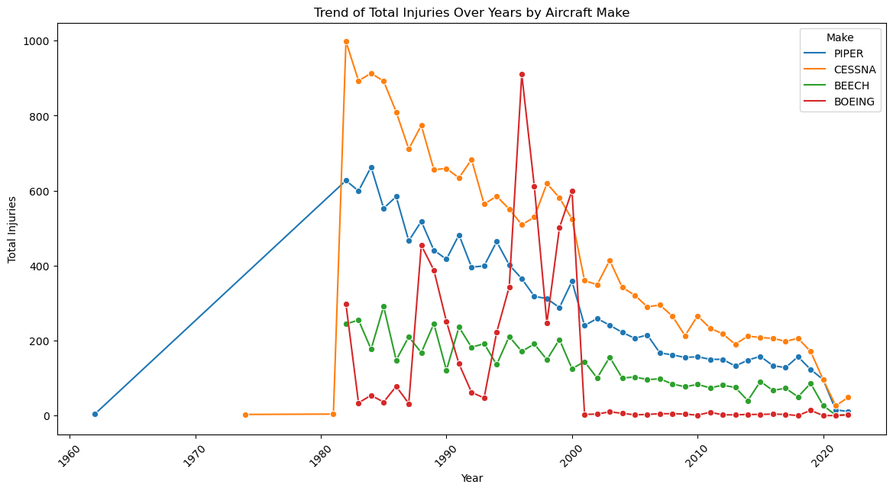
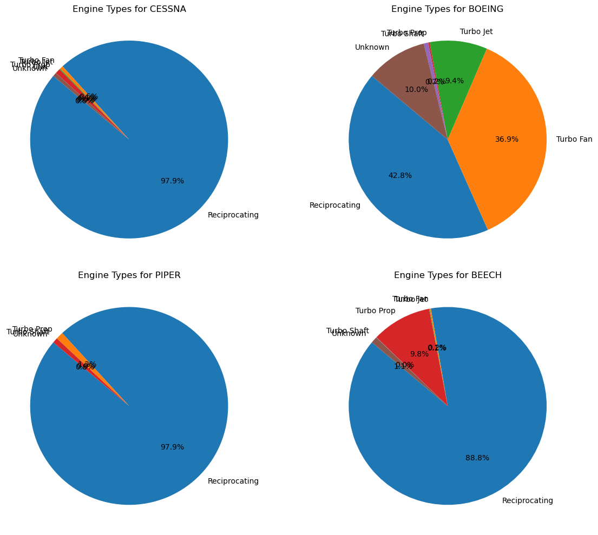
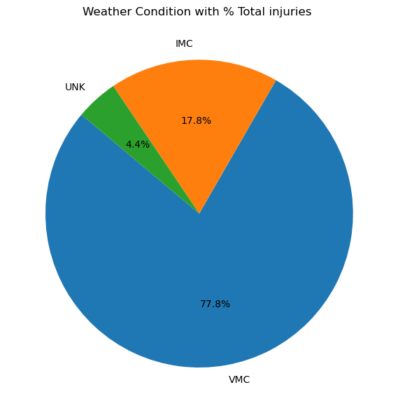
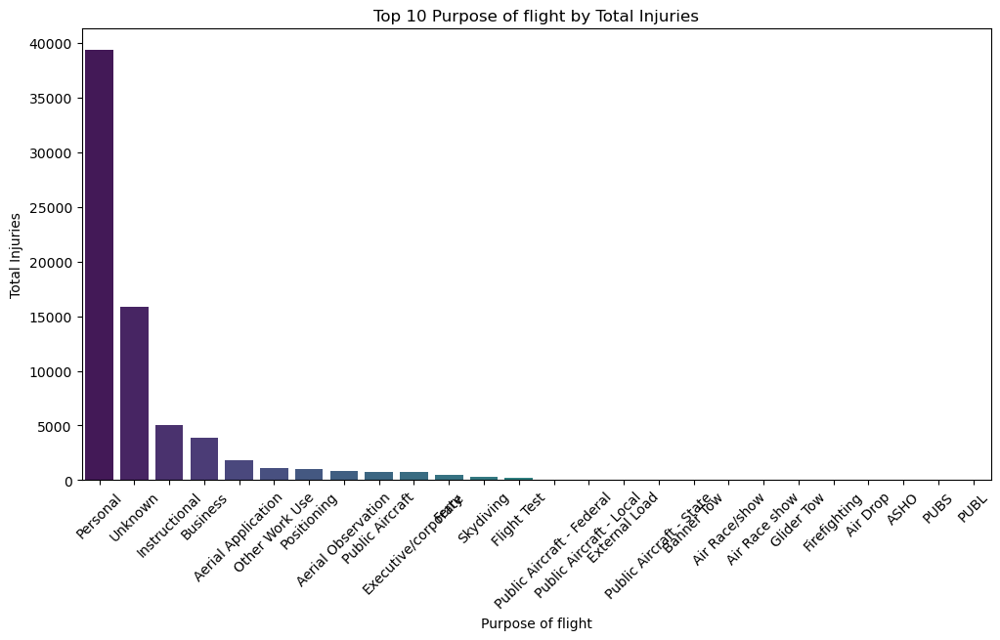
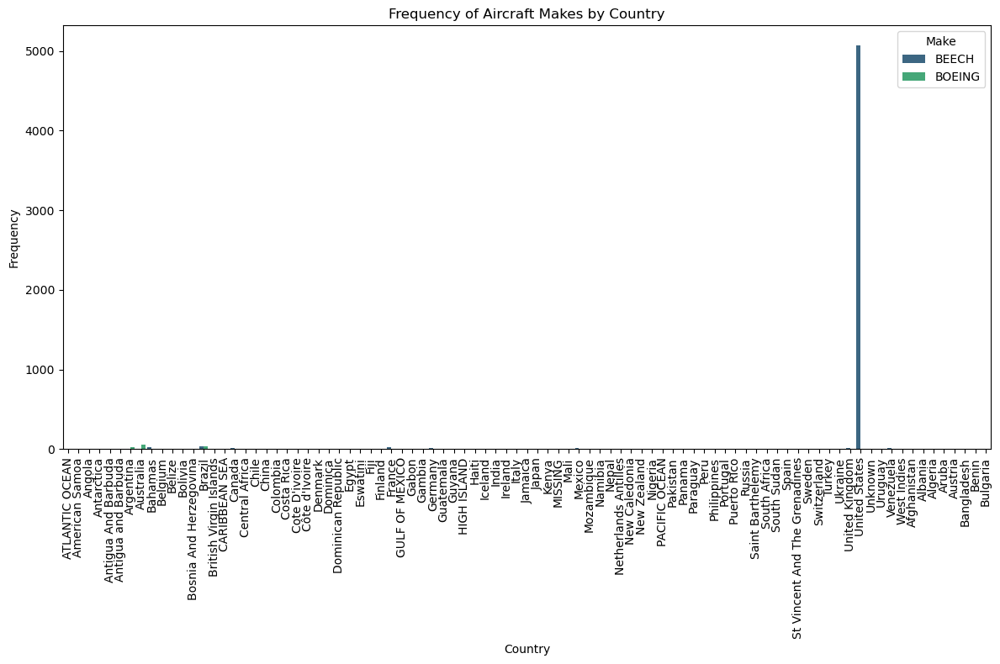
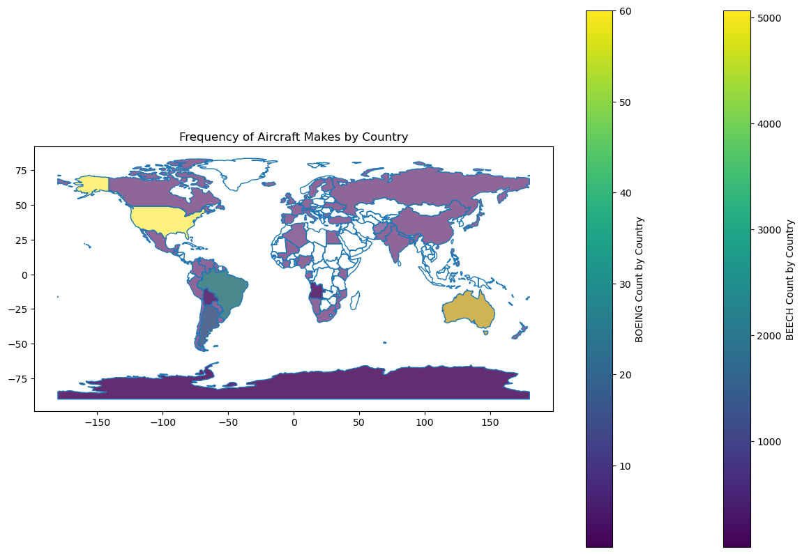

# Aviation Accident Database & Synopses, up to 2023

## Overview¶¶
This project analyzes data from the "Aviation Accident Database & Synopses" dataset to identify the safest and most cost-effective aircraft for a company looking to expand into the aviation industry. By reviewing accident and incident data, aircraft safety records, maintenance issues, and operational contexts, the project aims to provide actionable insights for minimizing risks and optimizing operational efficiency.

## Business Understanding
As the company diversifies its portfolio into the aviation sector, it faces significant risks associated with aircraft safety, maintenance costs, and operational efficiency. Selecting the right aircraft is crucial for ensuring the success of this new business endeavor. The aviation industry is highly competitive and regulated, requiring careful consideration of multiple factors to ensure safe, reliable, and cost-effective operations.

## Data Understanding
The "Aviation Accident Database & Synopses, up to 2023" from National Transportation Safety Board (NTSB),Kaggle NTSB aviation accident dataset, is a comprehensive dataset containing detailed information about aviation accidents and incidents. This dataset provides critical insights into various aspects of aviation safety and operational efficiency. For our analysis, we focus on the following key components of the dataset:

#### Accident and Incident Data: 
This includes detailed records of aviation accidents and incidents, encompassing data points such as the date, location, and severity of each event

#### Aircraft Information:
Details about the aircraft involved in each accident or incident, including model, manufacturer, and Engine ytpe, Number of engines and purpose of the flight.

#### Synopsis:
Brief summaries of each accident or incident, providing context and initial findings. Cause and Contributing Factors: Information on the identified causes and contributing factors for each event.

#### Weather Conditions:
Weather data at the time of each accident or incident.

Methods
This project employs descriptive analysis in various forms to understand the primary causes of aviation accidents. It also uses exploratory diagnostic analyses to explore correlations between different entries and the regions or states most frequently involved in aviation accidents. A significant part of the project focuses on data cleaning, including:

- Handling missing values
- Checking for duplicates
- Fixing structural issues

# Visualization.

### Total injuries by make over the years

### Engine Type Piechart 

### Weather condition by Total Injuries

### Purpose of flight by Total Injuries

### Make by Countries

# Final Recommendation and Conclusion for Business Aircraft Selection
## Observations:
Frequency of Aircraft Makes:
Cessna: Comprises 25% of all observed counts, the highest among the aircraft makes. Piper: Accounts for 13%, followed by Beech and Boeing, which are also prominent.

## Injury and Uninjured Cases:
High Total Injuries: Cessna, Boeing, Piper, and Beech show the highest total injuries. High Uninjured Cases: Boeing, McDonnell Douglas, Cessna, and Airbus lead in total uninjured cases, with Boeing having the highest number of uninjured cases.

## Engine Types:
Reciprocating engines had the highest accident incidences with the most total injuries.With Turbo fan used mostly by BOEING.

## Usage Patterns:
Beech: Mostly used for personal flights, followed by instructional and business purposes. Boeing: Commonly used within the United States for personal flights and a smaller number for business. Cessna: Primarily used for personal flights, with substantial usage for instructional purposes, business, and various operational needs like aerial applications.

## Geographical Distribution:
Majority of the data pertains to airplanes from the United States, with approximately 90% of Boeing aircraft originating from the United States.

## Safety Improvement:
Boeing: Demonstrates the most substantial improvement in reducing both injury and uninjured cases over time, suggesting effective safety enhancements. Cessna: Consistently shows positive trends in safety improvement, particularly suitable for smaller aircraft operations. Piper and Beech: Also show safety improvements but with generally lower case numbers compared to Boeing and Cessna.

## Recommendation:
Based on the comprehensive analysis, considering safety trends, usage patterns, and engine types, the following recommendations are made for selecting aircraft for business purposes:

## Boeing:
Recommendation: Boeing is highly recommended due to its significant improvement in safety and its high frequency of uninjured cases. Its robust safety record makes it a reliable choice for business purposes. Usage: Suitable for larger-scale operations and flights primarily within the United States, making it ideal for extensive business travel.

## Cessna:
Recommendation: Cessna is a strong contender, especially for smaller aircraft operations and versatility in usage. Its consistent safety improvements make it a dependable choice. Usage: Ideal for personal flights, instructional purposes, business, and specialized operations like aerial applications and observation.

## Piper and Beech:
Recommendation: While they show improvements, they are more suited for specific needs and smaller operations compared to Boeing and Cessna. They can be considered based on specific business requirements. Usage: Beech is mainly for personal and instructional flights, while Piper is versatile but with lower overall numbers.

# Conclusion:
For business aviation purposes, Boeing aircraft emerge as the top recommendation due to their significant safety improvements and extensive usage within the United States. Cessna aircraft also present a reliable option, particularly for versatile and smaller-scale operations. Both manufacturers have demonstrated strong commitments to safety, making them suitable choices for ensuring secure and efficient business travel. Continuous monitoring of safety trends, adherence to maintenance practices, and compliance with regulatory changes remain crucial to maintaining and enhancing aviation safety standards.

